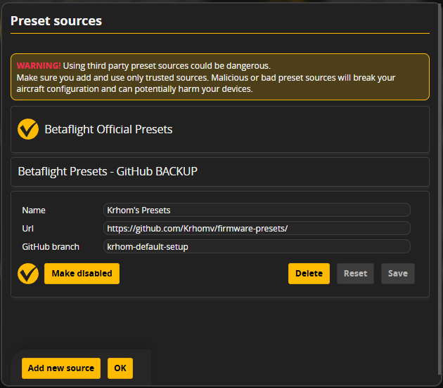

# How to Add Krhom's Presets to Betaflight

To use these custom tuning and filter presets in Betaflight Configurator, you need to add this repository as a custom preset source.

## Step-by-Step Instructions

1. Open **Betaflight Configurator** and connect your flight controller.
2. Navigate to the **Presets** tab on the left-hand menu.
3. Click on **Preset sources** (usually located near the top right).
4. In the Preset Sources dialog, click the **Add new source** button at the bottom left.
5. A new source entry will appear. Fill in the details exactly as follows:
   - **Name**: `Krhom's Presets`
   - **Url**: `https://github.com/Krhomv/firmware-presets/`
   - **GitHub branch**: `krhom-default-setup`
6. Click the **Save** button next to your new entry.
7. Make sure the source is active! You should see a yellow circle with a checkmark next to your preset source name, and the button below the branch name should say **Make disabled** (which means it is currently enabled).
8. Click **OK** to close the dialog.

You can now search for and apply the custom BandoLovers presets directly within Betaflight Configurator!

### Configuration Example
Reference the screenshot below to ensure your setup is correct:

*(Note: Please save your screenshot as `preset_sources.png` in the root of this repository so it displays correctly above).*
